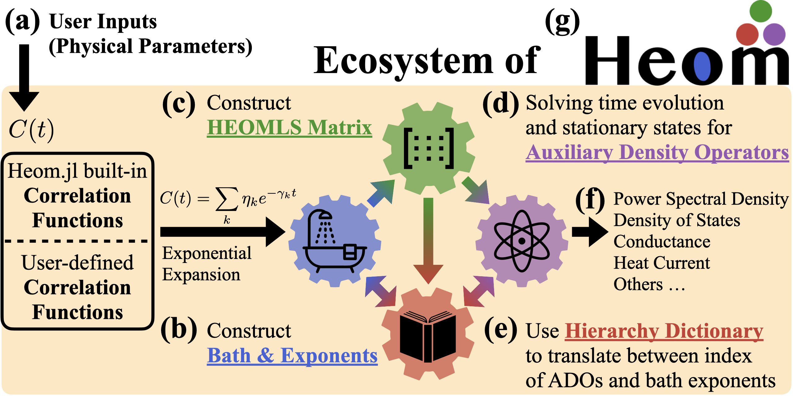

# HierarchicalEOM.jl

| **Release**       | [![Release][release-img]][release-url] [![License][license-img]][license-url] [![arXiv][arxiv-img]][arxiv-url] |
|:-----------------:|:-------------|
| **Runtests**      | [![Runtests][runtests-img]][runtests-url] [![Coverage][codecov-img]][codecov-url] [![Aqua QA][aqua-img]][aqua-url] [![JET][jet-img]][jet-url] |
| **Documentation** | [![Doc-Stable][docs-stable-img]][docs-stable-url] [![Doc-Dev][docs-develop-img]][docs-develop-url] |

[release-img]: https://img.shields.io/github/release/NCKU-QFort/HierarchicalEOM.jl.svg
[release-url]: https://github.com/NCKU-QFort/HierarchicalEOM.jl/releases

[license-img]: https://img.shields.io/badge/License-Apache%202.0-blue.svg
[license-url]: https://opensource.org/licenses/Apache-2.0

[arxiv-img]: https://img.shields.io/badge/arXiv-2306.07522-<COLOR>.svg
[arxiv-url]: https://arxiv.org/abs/2306.07522

[runtests-img]: https://github.com/NCKU-QFort/HierarchicalEOM.jl/actions/workflows/Runtests.yml/badge.svg
[runtests-url]: https://github.com/NCKU-QFort/HierarchicalEOM.jl/actions/workflows/Runtests.yml

[codecov-img]: https://codecov.io/gh/NCKU-QFort/HierarchicalEOM.jl/branch/main/graph/badge.svg?token=237Z7F7OOV
[codecov-url]: https://codecov.io/gh/NCKU-QFort/HierarchicalEOM.jl

[aqua-img]: https://raw.githubusercontent.com/JuliaTesting/Aqua.jl/master/badge.svg
[aqua-url]: https://github.com/JuliaTesting/Aqua.jl

[jet-img]: https://img.shields.io/badge/%F0%9F%9B%A9%EF%B8%8F_tested_with-JET.jl-233f9a
[jet-url]: https://github.com/aviatesk/JET.jl

[docs-stable-img]: https://img.shields.io/badge/docs-stable-blue.svg
[docs-stable-url]: https://ncku-qfort.github.io/HierarchicalEOM.jl/stable/
[docs-develop-img]: https://img.shields.io/badge/docs-dev-blue.svg
[docs-develop-url]: https://ncku-qfort.github.io/HierarchicalEOM.jl/dev/

`HierarchicalEOM.jl` is a numerical framework written in [`Julia`](https://julialang.org/). It provides a user-friendly and efficient tool based on hierarchical equations of motion (HEOM) approach to simulate complex open quantum systems, including non-Markovian effects due to non-perturbative interaction with one (or multiple) environment(s). It is inspired by the [Quantum Toolbox in Python (QuTiP)](https://qutip.org).



## Installation
To install `HierarchicalEOM.jl`, run the following commands inside Julia's interactive session (also known as REPL):
```julia
using Pkg
Pkg.add("HierarchicalEOM")
```
Alternatively, this can also be done in Julia's [Pkg REPL](https://julialang.github.io/Pkg.jl/v1/getting-started/) by pressing the key `]` in the REPL to use the package mode, and then type the following command:
```julia-REPL
(1.9) pkg> add HierarchicalEOM
```
More information about `Julia`'s package manager can be found at [`Pkg.jl`](https://julialang.github.io/Pkg.jl/v1/).  
`HierarchicalEOM.jl` now requires Julia 1.9 or higher. Installing it on an older version of Julia will result in many errors.

To load the package and check the version information, use the command:
```julia
julia> using HierarchicalEOM
julia> HierarchicalEOM.versioninfo()
```

## Documentation
The documentation can be found in :
- [**STABLE**](https://ncku-qfort.github.io/HierarchicalEOM.jl/stable) : most recently tagged version.
- [**DEVELOP**](https://ncku-qfort.github.io/HierarchicalEOM.jl/dev/) : in-development version.

## Cite `HierarchicalEOM.jl`
If you like `HierarchicalEOM.jl`, we would appreciate it if you starred the repository in order to help us increase its visibility. Furthermore, if you find the framework useful in your research, we would be grateful if you could cite our publication [ [Commun. Phys. 6, 313 (2023)](https://doi.org/10.1038/s42005-023-01427-2)  ] using the following bibtex entry:
```bib
@article{HierarchicalEOM-jl2023,
  doi = {10.1038/s42005-023-01427-2},
  url = {https://doi.org/10.1038/s42005-023-01427-2},
  year = {2023},
  month = {Oct},
  publisher = {Nature Portfolio},
  volume = {6},
  number = {1},
  pages = {313},
  author = {Huang, Yi-Te and Kuo, Po-Chen and Lambert, Neill and Cirio, Mauro and Cross, Simon and Yang, Shen-Liang and Nori, Franco and Chen, Yueh-Nan},
  title = {An efficient {J}ulia framework for hierarchical equations of motion in open quantum systems},
  journal = {Communications Physics}
}
```

## License
`HierarchicalEOM.jl` is released under the [Apache 2 license](./LICENSE.md).
