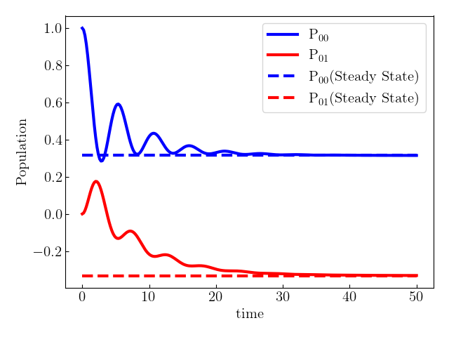
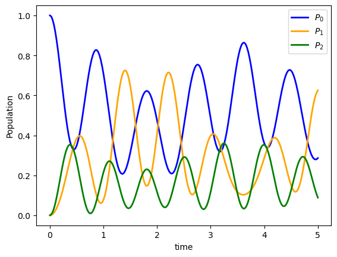

# Quick Start

(*This notebook can be found on* [github](https://github.com/NCKU-QFort/HierarchicalEOM.jl/blob/main/docs/src/notebooks/quick_start.ipynb))

### Content
 - [Import HierarchicalEOM.jl](#Import-HierarchicalEOM.jl)
 - [System and Bath](#System-and-Bath)
 - [HEOM Liouvillian superoperator](#HEOM-Liouvillian-superoperator)
 - [Time Evolution](#Time-Evolution)
 - [Stationary State](#Stationary-State)
 - [Reduced Density Operator](#Reduced-Density-Operator)
 - [Expectation Value](#Expectation-Value)
 - [Multiple Baths](#Multiple-Baths)
### Import HierarchicalEOM.jl
Here are the functions in `HierarchicalEOM.jl` that we will use in this tutorial (Quick Start):


```julia
import HierarchicalEOM
import HierarchicalEOM: Boson_DrudeLorentz_Pade, M_Boson, evolution, SteadyState, getRho, BosonBath, Expect
```

Note that you can also type `using HierarchicalEOM` to import everything you need in `HierarchicalEOM.jl`.
To check the versions of dependencies of `HierarchicalEOM.jl` , run the following function


```julia
HierarchicalEOM.versioninfo()
```
    
### System and Bath
Let us consider a simple two-level system coupled to a Drude-Lorentz bosonic bath. The system Hamiltonian, ``H_{sys}``, and the bath spectral density, ``J_D``, are

```math
 H_{sys}=\frac{\epsilon \sigma_z}{2} + \frac{\Delta \sigma_x}{2} ~~\text{and}
```  

```math
J_{D}(\omega)=\frac{2\lambda W\omega}{W^2+\omega^2},
```
#### System Hamiltonian and initial state
You can construct system hamiltonian, initial state, and coupling operators by standard julia bulit-in types: `Vector`, `SparseVector`, `Matrix`, `SparseMatrix`.

Moreover, it is also convenient to use [QuantumOptics](https://qojulia.org/) framework. It provides many useful functions to create arbitrary quantum states and operators which can be combined in all the expected ways.

Note that `HierarchicalEOM.jl` only accept standard julia bulit-in types. If you use `QuantumOptics` to construct the operators, remember that the matrix (or vector) in standard type are stored in `.data` field of the objects, i.e., `op.data` where `op` is a `QuantumOptics`-type object.  
Thus, you should take it as the inputs of `HierarchicalEOM.jl` for objects in `QuantumOptics` package.

We demonstrate this tutorial by `QuantumOptics`:


```julia
import QuantumOptics: SpinBasis, sigmaz, sigmax, ⊗, Ket, Bra
```


```julia
basis = SpinBasis(1//2)

# The system Hamiltonian
ϵ = 0.5 # energy of 2-level system
Δ = 1.0 # tunneling term

Hsys = 0.5 * ϵ * sigmaz(basis) + 0.5 * Δ * sigmax(basis)

# System initial state
ρ0 = Ket(basis, [1, 0]) ⊗ Bra(basis, [1, 0])
```

#### Bath Properties
Now, we demonstrate how to describe the bath using the built-in implementation of ``J_D(\omega)`` under Pade expansion by calling [`Boson_DrudeLorentz_Pade`](@ref)


```julia
λ = 0.1  # coupling strength
W = 0.5  # cut-off frequency
T = 0.5  # temperature

# system-bath coupling operator
Q = sigmaz(basis);

# Number of expansion terms to retain:
N = 2

# Padé expansion:
## Remember to give the operator in Standard matrix (AbstractMatrix) type
## That is, if using QuantumOptics package, give system coupling operator as Q.data
bath = Boson_DrudeLorentz_Pade(Q.data, λ, W, T, N)
```

For other different expansions of the different spectral density correlation functions, please refer to [Bosonic Bath](@ref doc-Bosonic-Bath) and [Fermionic Bath](@ref doc-Fermionic-Bath).
### HEOM Liouvillian superoperator
For bosonic bath, we can construct the HEOM Liouvillian superoperator matrix by calling [`M_Boson`](@ref)


```julia
# maximum tier of hierarchy
tier = 5

# Remember to give the operator in Standard matrix (AbstractMatrix) type
# That is, if using QuantumOptics package, give system hamiltonian as Hsys.data
L = M_Boson(Hsys.data, tier, bath; verbose=false)
```

To learn more about the HEOM Liouvillian superoperator matrix (including other types: `M_Fermion`, `M_Boson_Fermion`), please refer to [HEOMLS Matrices](@ref doc-HEOMLS-Matrix).
### Time Evolution
Next, we can calculate the time evolution for the entire auxiliary density operators (ADOs) by calling [`evolution`](@ref)


```julia
tlist = 0:0.2:50
ados_list = evolution(L, ρ0.data, tlist; verbose=false)
```

To learn more about `evolution`, please refer to [Time Evolution](@ref doc-Time-Evolution).
### Stationary State
We can also solve the stationary state of the auxiliary density operators (ADOs) by calling [`SteadyState`](@ref).


```julia
ados_steady = SteadyState(L; verbose=false)
```

To learn more about `SteadyState`, please refer to [Stationary State](@ref doc-Stationary-State).
### Reduced Density Operator
To obtain the reduced density operator, one can either access the first element of auxiliary density operator (`ADOs`) or call [`getRho`](@ref):


```julia
# reduce density operator in third time step of the evolution
ρ = ados_list[3][1]
ρ = getRho(ados_list[3])

# reduce density operator in stationary state
ρ = ados_steady[1]
ρ = getRho(ados_steady)
```

One of the great features of `HierarchicalEOM.jl` is that we allow users to not only considering the density operator of the reduced
state but also easily take high-order terms into account without struggling in finding the indices (see [Auxiliary Density Operators](@ref doc-ADOs) and [Hierarchy Dictionary](@ref doc-Hierarchy-Dictionary) for more details).
### Expectation Value
We can now compare the results obtained from `evolution` and `SteadyState`:


```julia
# Define the operators that measure the populations of the two
# system states:
P00 = Ket(basis, [1, 0]) ⊗ Bra(basis, [1, 0])
P11 = Ket(basis, [0, 1]) ⊗ Bra(basis, [0, 1])

# Define the operator that measures the 0, 1 element of density matrix
# (corresponding to coherence):
P01 = Ket(basis, [1, 0]) ⊗ Bra(basis, [0, 1])
```


```julia
# for steady state
p00_s = Expect(P00.data, ados_steady)
p01_s = Expect(P01.data, ados_steady)

# for time evolution
p00_e = Expect(P00.data, ados_list)
p01_e = Expect(P01.data, ados_list)
```

### Plot the results


```julia
using PyPlot, LaTeXStrings
```

```julia
lw = 3
plot(tlist, p00_e, "-", linewidth=lw, color="blue", label=L"\textrm{P}_{00}")
plot(tlist, p01_e, "-", linewidth=lw, color="red",  label=L"\textrm{P}_{01}")
plot(tlist, ones(length(tlist)) .* p00_s, "--", linewidth=lw, color="blue", label=L"\textrm{P}_{00} \textrm{(Steady State)}")
plot(tlist, ones(length(tlist)) .* p01_s, "--", linewidth=lw, color="red",  label=L"\textrm{P}_{01} \textrm{(Steady State)}")
xlabel("time")
ylabel("Population")
legend()
```





### Multiple Baths
`HierarchicalEOM.jl` also supports for system to interact with multiple baths.  
All you need to do is to provide a list of baths instead of a single bath

Note that, for the following, we use the built-in linear algebra in Julia (instead of `QuantumOptics.jl`) to construct the operators 


```julia
# The system Hamiltonian
Hsys = [
    0.25 1.50 2.50;
    1.50 0.75 3.50;
    2.50 3.50 1.25
]

# System initial state
ρ0 = [
    1 0 0;
    0 0 0;
    0 0 0
];

# Construct one bath for each system state:
## note that `BosonBath[]` make the list created in type: Vector{BosonBath}
baths = BosonBath[]
for i in 1:3
    # system-bath coupling operator: |i><i|
    Q = zeros(3, 3)
    Q[i, i] = 1
    
    push!(baths, Boson_DrudeLorentz_Pade(Q, λ, W, T, N))
end
```


```julia
L = M_Boson(Hsys, tier, baths; verbose=false)
```


```julia
tlist = 0:0.025:5
ados_list = evolution(L, ρ0, tlist; verbose=false)
```


```julia
# Projector for each system state:
P00 = [1 0 0; 0 0 0; 0 0 0]
P11 = [0 0 0; 0 1 0; 0 0 0]
P22 = [0 0 0; 0 0 0; 0 0 1]

# calculate population for each system state:
p0 = Expect(P00, ados_list)
p1 = Expect(P11, ados_list)
p2 = Expect(P22, ados_list)
```


```julia
lw = 2
plot(tlist, p0, "-",  linewidth=lw, color="blue",   label=L"P_0")
plot(tlist, p1, "-",  linewidth=lw, color="orange", label=L"P_1")
plot(tlist, p2, "-", linewidth=lw, color="green",   label=L"P_2")
xlabel("time")
ylabel("Population")
legend()
```




Note that this example can also be found in [qutip documentation](https://qutip.org/docs/latest/guide/heom/bosonic.html).
